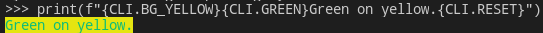
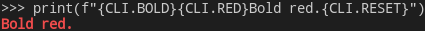
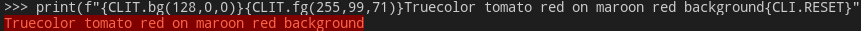

# clicolor

Quick python reference for terminal color escape codes

## Usage

Install options:

- Install the package `clicolor`

- Add as a submodule

```python
git submodule add https://github.com/camas/clicolors
```

- Or just copy `cli.py` and `LICENSE` somewhere

Then `from clicolor.cli import CLI, ...`

## Examples

```python
print(f"{CLI.BG_YELLOW}{CLI.GREEN}Green on yellow.{CLI.RESET}")
```



```python
print(f"{CLI.BOLD}{CLI.RED}Bold red.{CLI.RESET}")
```



```python
print(f"{CLIT.bg(128,0,0)}{CLIT.fg(255,99,71)}Truecolor tomato red on maroon red background{CLI.RESET}")
```



## test.py

use test.py to run a variety of tests including modifiers, 8/16 colors, 256 colors and Truecolors.
